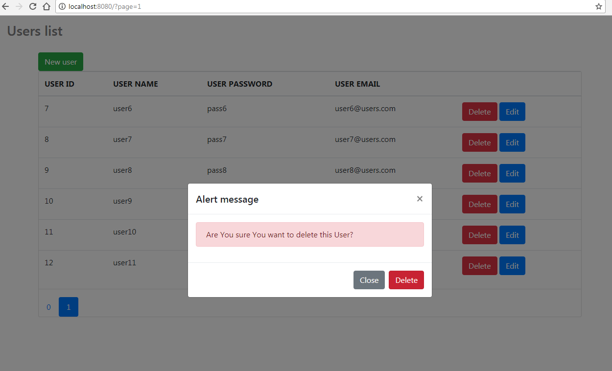

# Users List Web Application
&ensp;&ensp;&ensp;

Users list is a Spring boot web application which use Spring boot 2.0 framework, JPA + Web + Dev-tools technologies and Thymeleaf + Bootstrap frameforks and jQuery for beatyfull views. 

Application have got Crud functionalities as: 
  - create entity;
  - update entity;
  - delete entity;
  
For data persistance, as a database, used Jpa technology without any data base. Also project use dinamical modals to showing views.

So  this web application example is very easy and simple to beginners to learning becaose of simple implementation of code. Web application test also are included. 
    
I hope my web application let You better understand Spring framework especially Spring boot & Jpa persistance and data handling. Have a nice learning.  

<h3>Users list form database</h3>

User have gote oportunity see all intities are in database. Here simple pagination functionality is possible. 

<h3>New user adding</h3>

User can create new intities. New user adding function calling on dinamical modal.

<h3>Existing user updating</h3>

User can update existing intities. Updating function also calling on dinamical modal.

<h3>Existing user removing</h3>

User can remove existing intities. To showing alert message calling dinamical modal.

<h3>Test for web application adding, removing, updating functions</h3>

Here are three simple test methods for adding, updating, removing entities to improve web application works correctly. 

<h4>Technologies: Spring Boot 2.0.0, JPA, Web,Dev-tools technologies, Thymeleaf + Bootstrap frameforks and jQuery</h4>
