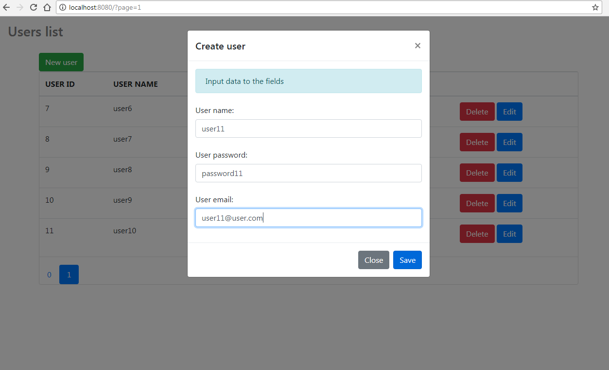

# Users List Web Application
&ensp;&ensp;&ensp;

Users list is a Spring boot web application which use Spring boot 2.0 framework, JPA + Web + Dev-tools technologies and Thymeleaf + Bootstrap frameforks and jQuery for beatyfull views. 

Application have got Crud functionalities as: 
  - create entity;
  - update entity;
  - delete entity;
  
For data persistance, as a database, used Jpa technology without any data base. Also project use dinamical modals to showing views.

<h3>Users list form database</h3>

User have gote oportunity see all intities are in database. Here simple pagination functionality is possible. 

<h3>Users list form database</h3>

User can create new intities. 

<h4>Technologies: Spring Boot 2.0.0, JPA, Web,Dev-tools technologies, Thymeleaf + Bootstrap frameforks and jQuery</h4>
